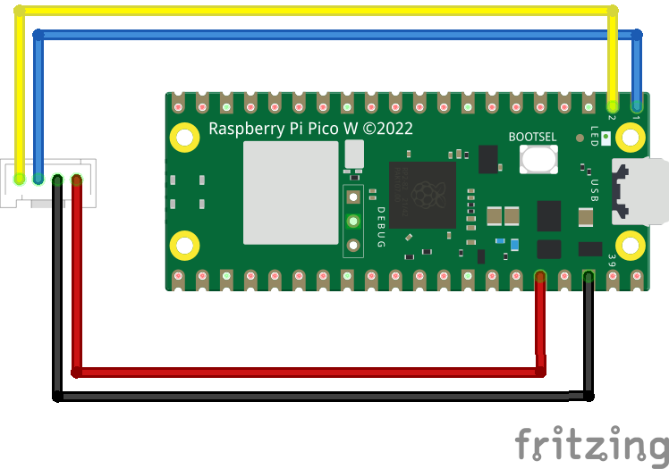

# Person Sensor in CircuitPython
How to access the Useful Sensor's Person Sensor from CircuitPython

## Introduction

The Person Sensor is a small hardware module that's intended to make it easy to
find out when people are near a device, where they are, and who they are. It has
an image sensor and a microcontroller with pretrained ML models that use
computer vision to spot faces. 

There's a [detailed developer guide](https://usfl.ink/ps_dev)
available, but this project has sample code that shows you specifically how to 
get the sensor up and running with a Raspberry Pi Pico using CircuitPython.

It should also work on other boards using CircuitPython, but you'll have to
update the pin numbers and I2C initialization code to match their 
configurations.

## Wiring

For this example we'll be using the first I2C bus. If you're using a standard
[Qwiic connector](https://www.sparkfun.com/qwiic), the colors will be black for 
GND, red for 3.3V, blue for SDA, and yellow for SDC. You'll connect GND to pin
38, 3.3V to pin 36, SDA to pin 1, and SDC to pin 2.

## Running

Copy the `code.py` file in this folder over to the `CIRCUITPY` drive. If you
connect over `minicom` or a similar program to view the logs, you should see
information about the faces seen by the sensor printed out, and messages about
any errors encountered.

